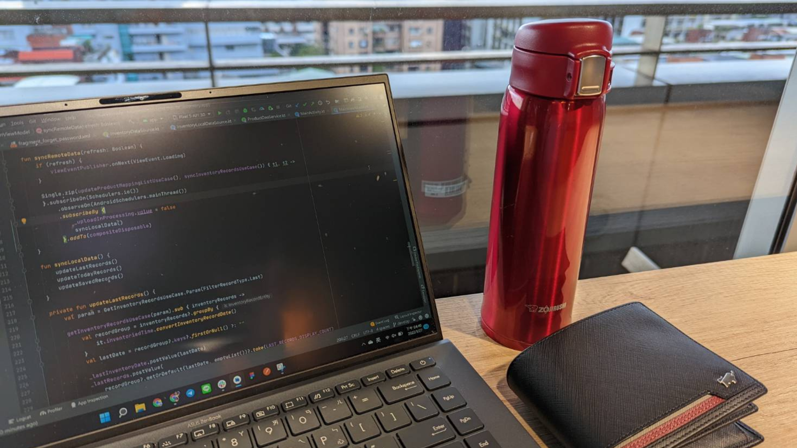
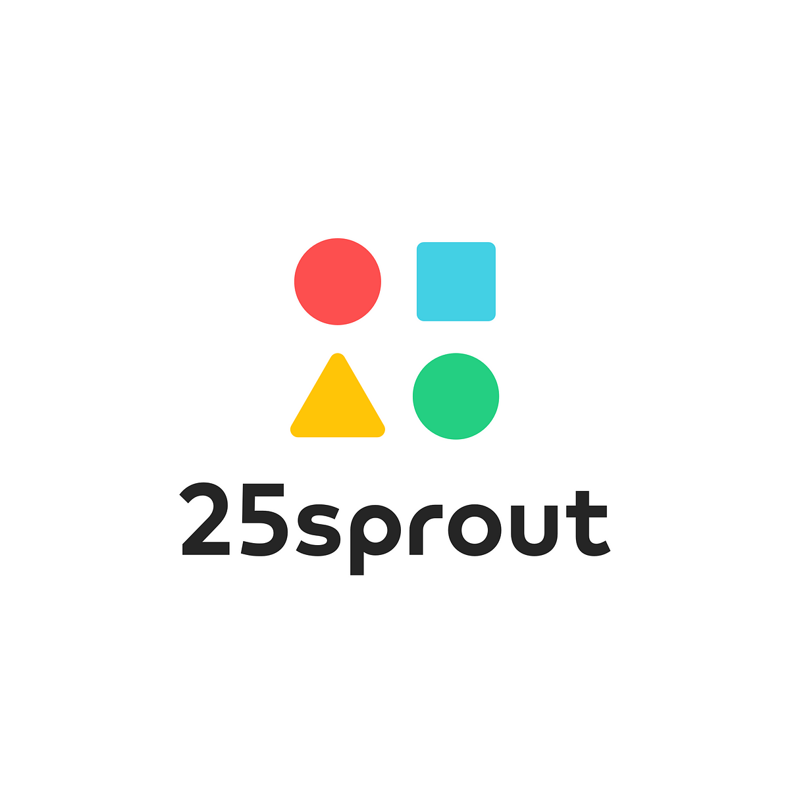

  <h1>
   Hi there, I'm Roger
   
  </h1>
  

  
    
  
  

  

### About Me :
- Have ambitious for being a great android developer
- Likes to buy fun tech products
- Major in Information Management

### Work Experience
-  PressPlay, Android Engineer 2023.5 - now
-  StreetVoice, Android Engineer 2022.11 - 2023.3
-  25sprout, Android Developer Intern 2021.7 - 2022.6

### Links and CVs
- [PDF](https://drive.google.com/drive/folders/1Cwlu1cUnAPzIZHeXVF9Y88Z6oHSCA1WD?usp=sharing)

### Languages and Tools :
<code></code>
<code></code>
<code></code>
<code></code>
<code></code>
